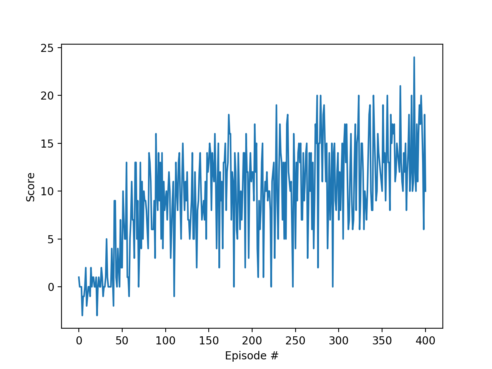

# Report

## Algorithm

Since the state space of this environment is continuous (agent velocity is a scalar, for example) we need to either 
discretize it or use a value function approximation method. I chose to go with DQN for this reason. I do suspect the 
problem is quite easily solvable using tiling as well though.

## Q network architecture

A simple fully connected network with two hidden layers sufficed to solve the environment within 500 episodes.

It looks like this:
* input layer of size 37 (state vector size)
* hidden layer of size 64
* hidden layer of size 64
* output layer of size 4 (action space size)

## Hyperparameters

I did some rudimentary manual grid search of the hyperparameter space and ended up with the following:

* alpha: 0.0005
* gamma: 0.99
* learning batch size: 100
* replay buffer size: 10^5
* epsilon: starts at 1, decays with factor .9999, bottoms out at 0.01
* tau: 0.001

## Results

### First solution

My first solution considers the environment solved when reaching an average score of 13 over 100 episodes.

The algorithm as outlined above reached a solution in about 500 iterations (well below the 1800 episodes the project 
description mentions). The algorithm improves quite fast, but seems to reach a plateau at two points:

TODO: gif of trained agent.

### Second solution

I then tried to squeeze a bit more out of the algorithm, both by trying to reach a higher average score within 1800 
episodes and by playing with the parameters and network a bit more.

* TODO: pushing a bit further - describe results.

## Ideas for future work

1. A more structured and thorough search of the algorithm's parameters would most likely result in a more efficient 
solution. A **parallellized grid search** of the hyperparameter space would be interesting. 

2. An intriguing parameter is the **learning batch size**: a larger batch size seems to result in faster learning, but 
is this always the case? What is the limit? When does the necessary computation become too much for the added gain of 
learning faster?

3. This algorithm is a vanilla DQN implementation. This more than suffices to solve the problem at hand but implementing 
a few tweaks (or the full rainbow DQN) would almost certainly result in quicker convergence:
    * prioritized buffer replay to prefer learning from bad estimates
    * double DQN might learn more efficiently
    * noisy networks could be an interesting alternative for the epsilon parameter

4. Solving the problem from pixels instead of the ray traced state vectors, as suggested by the Udacity project 
description would be an interesting exercise.