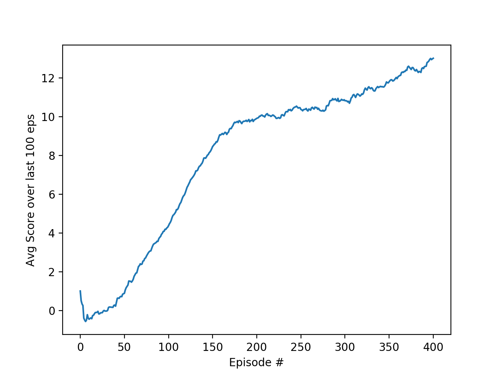
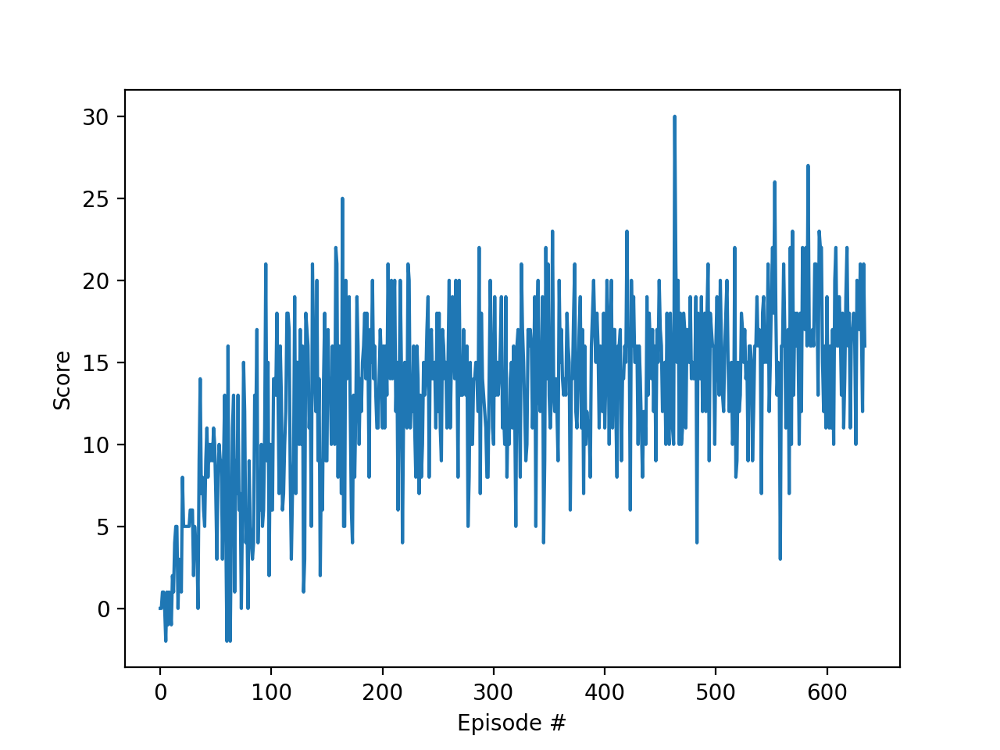

# Report

## Algorithm

Since the state space of this environment is continuous (agent velocity is a scalar, for example) we need to either 
discretize it or use a value function approximation method. I chose to go with (vanilla) DQN for this reason. I do 
suspect the problem is quite easily solvable using tiling as well though since it did not appear very challenging for 
the DQN algorithm.


## Results

Spoiler alert: I was able to solve the stated goal of 13+ average score within 200 episodes. I was also able to push the 
goal post further up to an average score of 16.5.


_a trained agent_

### 1. Initial solution

My first solution considers the environment solved when reaching an average score of 13+ over 100 episodes, as stated in 
the project requirements.

#### Hyper-parameters

I initially used parameters very similar to the lander environment treated in class, just trying to get to the goal of
13+ average score.

* **Learning rate alpha**: 0.0005
* **Reward discount factor gamma**: 0.99
* **Learning batch size**: 100
* **Replay buffer size**: 10^5
* **Explore-exploit parameter epsilon**: starts at 1, decays with factor .9999, bottoms out at 0.01
* **Target network soft-update parameter tau**: 0.001

#### Q-network architecture

A simple fully connected network with two hidden layers sufficed to solve the environment quickly. (The extra 
convolutional layers used in the Deepmind paper are probably not really necessary since we're not dealing with 
images.)

It looks like this:

| Layer         | Size                   |
| ------------- | -----------------------|
| input         | 37 (state vector size) |
| hidden (FC)   | 64                     |
| hidden (FC)   | 64                     |
| output (FC)   | 4 (action space size)  |

The algorithm as outlined above reached a solution in about 400 iterations (well below the 1800 episodes the project 
description mentions as a reference). 

Sample training output:
```
Training agent.
Iteration 100 - avg score of 4.29 over last 100 episodes
Iteration 200 - avg score of 9.88 over last 100 episodes
Iteration 300 - avg score of 10.87 over last 100 episodes
Iteration 400 - avg score of 12.98 over last 100 episodes
Environment solved in 401 iterations with a score of 13.01
Training ended with an avg score of 13.01 over last 100 episodes
Max score: 24.0
```

Plotted scores show a steep initial learning phase followed by a slower but steady increase to the goal of 13+ average:




### 2. Tweaked solution

I then tried to squeeze a bit more out of the algorithm, both by trying to reach a higher average score and by playing 
with the parameters and network a bit more. I set out to reach a higher score within 1800 episodes.

#### Hyperparameters

I did some rudimentary manual grid search of the hyper-parameter space and ended up with the following:

* **alpha**: 0.0001 
  _-> I made this 5 times smaller, sped up training and resulted in a higher convergence score (better generalisation?)_
* **gamma**: 0.99 
  _-> seems to have little effect as long as it is near 1, since this is an episodic task we can see the end_
* **learning batch size**: 100 
  _-> increasing this boosts learning speed, see 'further work' section below_
* **replay buffer size**: 10^5 
  _-> as long as it is large enough this seems to have little effect_
* **epsilon**: starts at 1, decays with factor .9999, bottoms out at 0.01 
  _-> increasing epsilon_min results in a lower average training score because there is too much exploration_
* **tau**: 0.001
  _-> I didn't experiment with this parameter, see 'further work' section_
  
#### Q-network architecture

Playing with the network architecture revealed better performance with an even smaller network. After trying a number of 
different configurations I found that a network with smaller hidden layers worked better than my original version.

The smaller network looks like this:

| Layer         | Size                   |
| ------------- | -----------------------|
| input         | 37 (state vector size) |
| hidden (FC)   | 25                     |
| hidden (FC)   | 25                     |
| output (FC)   | 4 (action space size)  |

The algorithm as outlined above reached a solution for the original goal of 13+ in less than 200 iterations. It seems to 
max out around 16.5 which it is able to reach in about 650 episodes.

_Training output on the original goal of 13+:_
```
Training agent.
Iteration 100 - avg score of 7.01 over last 100 episodes
Environment solved in 172 iterations with a score of 13.08
Training ended with an avg score of 13.08 over last 100 episodes
Max score: 24.0
```


This goal is reached easily, often within 200 episodes.


_Training output on the harder goal of 16.5+:_
```
Training agent.
Iteration 100 - avg score of 6.07 over last 100 episodes
Iteration 200 - avg score of 12.77 over last 100 episodes
Iteration 300 - avg score of 13.82 over last 100 episodes
Iteration 400 - avg score of 14.08 over last 100 episodes
Iteration 500 - avg score of 14.84 over last 100 episodes
Iteration 600 - avg score of 15.88 over last 100 episodes
Environment solved in 635 iterations with a score of 16.52
Training ended with an avg score of 16.52 over last 100 episodes
Max score: 30.0
```




The goal of 16.5+ was usually reached in 600-800 episodes, but I never got much higher than that. I suppose I'm 
confronted with the limitations of vanilla DQN here.

---
## Further findings

* With vanilla DQN I could reach an average score of about 16.5 but not much higher (never reached 17, whatever I tried)
* Setting alpha a factor of 100 higher results in the algorithm not learning at all.
* Setting alpha higher than my initial setting of 5e^-4 would slow down learning, dropping it would speed up learning 
and allow reaching a score of 15+ in about 450 episodes.
* I tried a single-layer network of size 42 (no coincidence :-)) which performed similarly to the 20/20 network. I tried 
to bring down the 2-hidden-layer version to 10/10 but this seemed to lack the capacity needed to master the environment.
* Even when the environment is solved, the trained agent's performance seems quite inconsistent (see next section).


## Ideas for future work

1. A more structured and thorough search of the algorithm's parameters would most likely result in a more efficient 
solution. Doing a rough manual search has shown most of the parameters as well as the network architecture have a huge 
impact on the results. A **parallellized grid search** of the hyperparameter space would be interesting.

2. **Variance in the agent's performance**: the scores of the trained agent still show a huge variance, I would expect a
narrower range of scores when the agent has been trained well. Is this because the start state of the agent has a big
influence on what the maximum score for an episode is, or because the agent is still not very good at its job? 
Interesting to investigate.

3. An intriguing parameter is the **learning batch size**: a larger batch size seems to result in faster learning, but 
is this always the case? What is the limit? When does the necessary computation become too much for the added gain of 
learning faster?

4. This algorithm is a vanilla DQN implementation. This more than suffices to solve the problem at hand but implementing 
a few **tweaks** (or the full rainbow DQN) would almost certainly result in quicker convergence. I would first 
incorporate tensorboard for easier live monitoring and training dynamics comparison. Tweaks to try:
    * prioritized buffer replay to prefer learning from bad estimates
    * double DQN might learn more efficiently
    * noisy networks could be an interesting alternative for the epsilon parameter

5. Investigate the **tau** parameter to see if training can be more stable over longer time horizons (I found it 
oscillating when run for several thousands of episodes).

6. Solving the problem from pixels instead of the ray traced state vectors, as suggested by the Udacity project 
description would be an interesting exercise, mainly because I suspect the agent would be more intelligent regarding
batches of bananas perceived in the distance. The agent using vector states only sees what's right in front of it and 
its view of a cluster of yellow bananas in the distance seems to be blocked by any blue bananas in front of it. I think 
it might learn to see a cluster of yellow bananas in the distance and decide it is worth the trip rather than catching 
the one banana closer by but in the opposite direction.

7. Watching the trained agent perform I often notice superfluous actions (lots of left and right movements that are not 
strictly necessary), I would like to push on to get more stable and elegant behaviour. (The reward model does not 
explicitly punish excess movement but my intuition is that it should be possible anyway.)